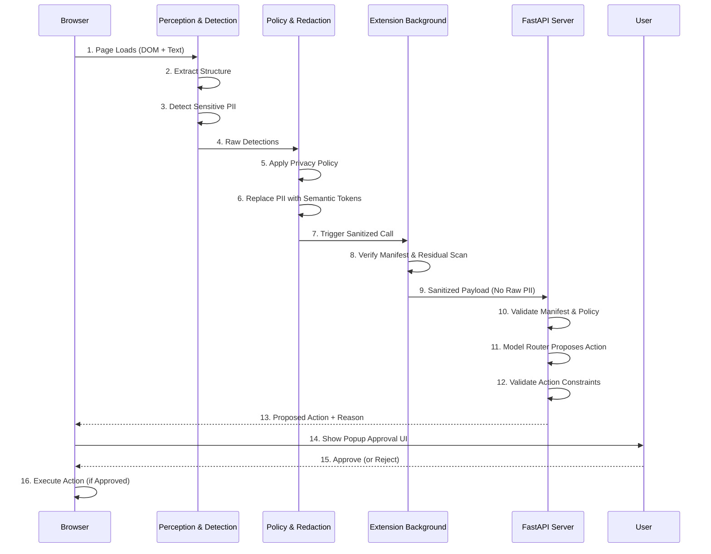

# PraxLight — Architecture (SIH 2026)

## Overview

PraxLight is a privacy-preserving browser agent system. Its purpose is to let an agent reason over a web page while keeping raw personal data local to the browser and exposing only a sanitized, policy-checked view to the backend.

The architecture is intentionally built around a simple idea:

- the page is observed locally
- sensitive fields are detected and redacted locally
- no raw PII is sent outside the browser unless the user approves a constrained action
- the backend acts only on sanitized data and validated instructions

## Security goal

The system is designed around a fail-closed model:

- if detection fails, the system stays conservative
- if the manifest is suspicious, the request is blocked
- if the target action is outside the known element set, it is rejected
- if the action is irreversible or high-risk, it requires explicit approval

## Main components

| Component | Files | Role |
| --- | --- | --- |
| Perception layer | `extension/content/perception.js` | Builds a structured snapshot of page state: visible text, inputs, interactive elements, viewport info, and related metadata. |
| Detection engine | `extension/content/privacy/detectors.js` | Scans the structured page snapshot for email, phone, PAN, card, name, and other sensitive patterns. |
| Policy engine | `extension/content/privacy/policy-engine.js` | Maps detections to redaction decisions and builds a privacy manifest used by the gating layer. |
| Redaction layer | `extension/content/privacy/redaction.js` | Replaces sensitive values with semantic tokens while preserving the structure needed for the agent to reason. |
| Content script orchestrator | `extension/content/content-script.js` | Coordinates local scan, residual scan, and execution of approved actions on the live page. |
| Background gate | `extension/background.js` | Owns the only outbound network path; re-checks manifests and ensures no raw content can be transmitted. |
| Web API | `server/main.py` | Receives sanitized payloads, validates manifest requirements, and exposes the agent endpoint. |
| Model router | `server/agent.py` | Chooses a model provider or falls back to deterministic local reasoning. |
| Validator | `server/validator.py` | Enforces schema validity, target existence, action constraints, and approval conditions. |
| Popup and dashboard UI | `extension/popup/*`, `dashboard/*` | Shows scan results, network guard logs, task context, and approval flow. |

## Threat model

The design assumes a malicious or unexpected page may contain sensitive customer information or attempt to mislead the agent.

The architecture therefore checks for:

- accidental leakage of PII from DOM inspection
- hidden or residual sensitive values after redaction
- unvalidated network requests from the browser extension
- arbitrary action generation by the model
- execution of high-risk actions without user approval

The system is intentionally conservative: when uncertainty exists, the safe behavior is to stop or block rather than continue.

## End-to-end flow

## Security boundaries

There are three major enforcement boundaries in the system:

### 1. Browser-local boundary
The page content is never treated as safe by default. All interpretation and redaction happen inside the extension context before data leaves the page.

### 2. Extension boundary
The browser extension owns the outbound network path. `background.js` is the only code path that may send data externally. This is the key design decision that prevents ad hoc fetch calls across content scripts.

### 3. Backend boundary
The server does not trust the browser blindly. It checks the manifest, confirms the payload is sanitized, and validates the proposed action before it can be accepted.

## Data contract

The current system sends a sanitized payload shaped around a privacy manifest and structured action request. In practical terms, the backend receives:

- task description
- sanitized page snapshot
- detected entity counts and redactions
- manifest metadata
- only the sanitized interactive and input metadata needed for decision-making

It does not receive raw text or raw user data from the live page.

## Why the background worker owns the network call

A browser extension has several execution contexts. The content script is intentionally not allowed to own the network boundary in this design.

This matters because:

- content scripts are tied to page execution
- network access should be centralized and auditable
- the same code path can enforce a single privacy gate instead of many scattered request sites
- one review point is easier to reason about and harder to bypass accidentally

The result is a single place to inspect for outbound data leakage: the extension background worker.

## Current implementation reality

This repo is a working prototype, not a full product deployment. The actual implemented flow is:

- local page capture and redaction
- local residual scan
- backend request only after policy gate passes
- deterministic or provider-backed routing to produce a structured action
- server validation and approval gate

Current limitations that are explicitly known include:

- no production-grade OCR pipeline in the live workflow
- model-backend adapters are present but not fully activated in the current main path
- the demo is designed for local validation rather than production deployment
- the approval UX is intentionally simple and explicit, not a full enterprise workflow

## Honest limitation

The system’s protection is strong against accidental leakage, but it still depends on the extension code itself being trustworthy. A maliciously modified browser extension could evade the checks, which is why the project remains a serious prototype and not a full end-to-end native security boundary.

For a production-grade version, the next step would be stronger independent logging, monitoring, and verification loops outside the extension itself.

## Related documents

- [`../README.md`](../README.md)
- [`PRIVACY_MODEL.md`](PRIVACY_MODEL.md)
- [`AGENT_PROTOCOL.md`](AGENT_PROTOCOL.md)
- [`CURRENT_IMPLEMENTATION.md`](CURRENT_IMPLEMENTATION.md)
- [`SIH_ALIGNMENT.md`](SIH_ALIGNMENT.md)

